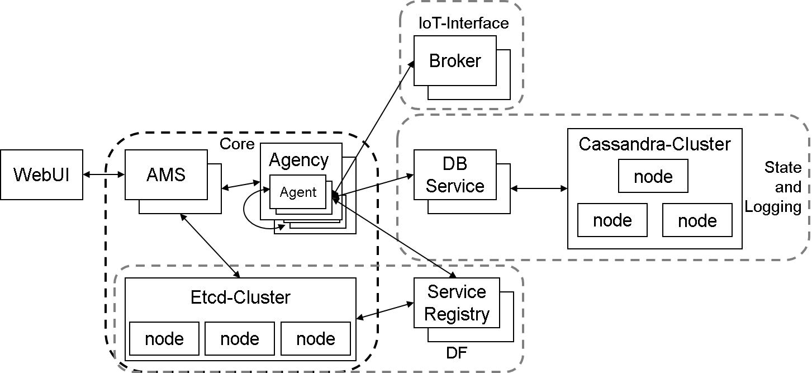

# cloneMAP: cloud-native Multi-Agent Platform

cloneMAP is a multi-agent platform (MAP) that is designed to run in a cloud environment based on [Kubernetes](https://kubernetes.io/).
The aim of this project is to combine the advantages of cloud computing and a distributed computing paradigm such as multi-agent systems.

## Overview

cloneMAP consists of four modules. Each module is implemented in a scalable and robust way. Where possible, applications are stateless and hence horizontally scalable. State is stored in distributed storages and databases. The single modules can be deployed  and used independently. They are coupled by means of REST APIs.

### Core

The *core* components of cloneMAP are the agent management system (AMS), an [etcd](https://coreos.com/etcd/) store and agencies. The AMS is responsible for managing all MASs and the corresponding agents running in cloneMAP. Typical tasks are agent creation, monitoring and termination. To allow the AMS to be horizontally scalable, its state (configuration and status information) is stored in an etcd cluster.

Agencies are the deployment unit for agents. Each agency hosts a specified number of agents. Agencies have the task to aggregate common operations in order to relieve the AMS. In Kubernetes terms an agency is a pod with one container. The agents are single go-routines executed within the agency.

### DF

To provide agents with the ability to explore each other the so called directory facilitator (*DF*) is implemented. It consists of the scalable service registry and an etcd store. The same etcd cluster as for the AMS is used. The service registry provides functionalities such as registering, deregistering and searching for services. Hence, agents can us it as yellow pages service.

### State and logging

As agents usually have a certain state that changes over time, that state needs to be saved in order to make the platform robust. This is done by module *state and logging*. A DB service provides agents with a REST API for storing state and logs. Upon restart the agents can query the last state stored in the DB and continue their work from that point. A Cassandra DB is used as backend.

### IoT

In order to connect the agents running in cloneMAP to the outside world a message broker is used. Currently only MQTT is available. With the help of this message broker agents can interact with devices outside the cloud (e.g. IoT-devices). This module is called *IoT-Interface*.

### UI

For easy user interaction it is planned to provide a WebUI that interacts with the AMS via its REST API. The WebUI is not yet available.

## Getting Started

To get started with cloneMAP have a look at the installation requirements, the developer guide and the user guide.

## Copyright

2020, Institute for Automation of Complex Power Systems, EONERC

## License

This project is licensed under either of

- Apache License, Version 2.0 ([LICENSE-Apache](LICENSE-Apache) or [http://www.apache.org/licenses/LICENSE-2.0](http://www.apache.org/licenses/LICENSE-2.0))
- MIT license ([LICENSE-MIT](LICENSE-MIT) or [https://opensource.org/licenses/MIT](https://opensource.org/licenses/MIT))

at you option.

## Contact

- [Stefan Dähling](mailto:sdaehling@eonerc.rwth-aachen.de)

[Institute for Automation of Complex Power Systems (ACS)](http://www.acs.eonerc.rwth-aachen.de)  
[EON Energy Research Center (EONERC)](http://www.eonerc.rwth-aachen.de)  
[RWTH University Aachen, Germany](http://www.rwth-aachen.de)  
